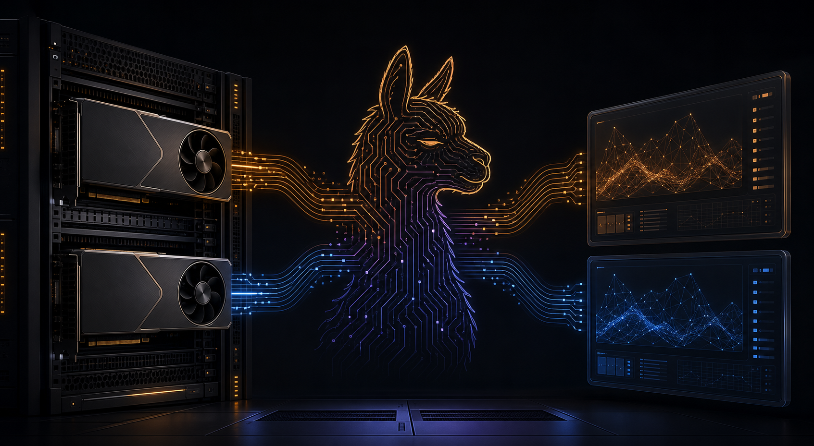

# Llama.cpp Command Center



A small, focused control panel for running local GGUF models with `llama-server` across multiple AMD GPUs. The Command Center keeps model discovery, GPU assignment, launch parameters, and live telemetry in one place.

## What it does

- Scans a model directory for GGUF files.
- Assigns a model to either GPU.
- Starts and stops one `llama-server` process per GPU.
- Pins each process with `ROCR_VISIBLE_DEVICES` and `HIP_VISIBLE_DEVICES`.
- Exposes OpenAI-compatible endpoints on the configured GPU ports.
- Sends launch parameters—including context size, CPU threads, GPU layers, and batch size—to llama.cpp.
- Supports optional CPU KV-cache placement with `--no-kv-offload`.
- Displays AMD telemetry and recent server logs.

## Architecture

The default configuration targets two GPUs:

| GPU | VRAM | API port |
|---|---:|---:|
| RX 7900 XT | 20 GB | `8081` |
| RX 6600 | 8 GB | `8082` |

Each server exposes an OpenAI-compatible API at `http://HOST:PORT/v1`.

## Run locally

```bash
cd orion_command_center
python3 -m venv .venv
source .venv/bin/activate
pip install -r requirements.txt
uvicorn app:app --host 0.0.0.0 --port 8000
```

Open `http://localhost:8000/` and select a model for either GPU. Stop a running server before changing its model or launch parameters.

## Configuration

Environment variables:

- `MODEL_DIR` — root directory containing GGUF files.
- `LLAMA_SERVER` — path to the `llama-server` binary.

The backend accepts this launch payload:

```json
{
  "model": "/models/example.gguf",
  "ctx": 65536,
  "threads": 8,
  "layers": 999,
  "batch": 512,
  "kv_offload": true
}
```

## Deployment

`gpu-command-center.service` is a systemd unit for a Linux host with ROCm and llama.cpp installed. After updating the files:

```bash
sudo systemctl restart gpu-command-center.service
sudo systemctl status gpu-command-center.service
```

## Notes

Large context windows consume substantial memory. On smaller GPUs, reduce GPU layers and enable CPU KV-cache placement to trade speed for capacity. Test each model and context size with the actual workload before relying on it for long-running agent sessions.

## License

See the repository history and project owner for licensing information.
